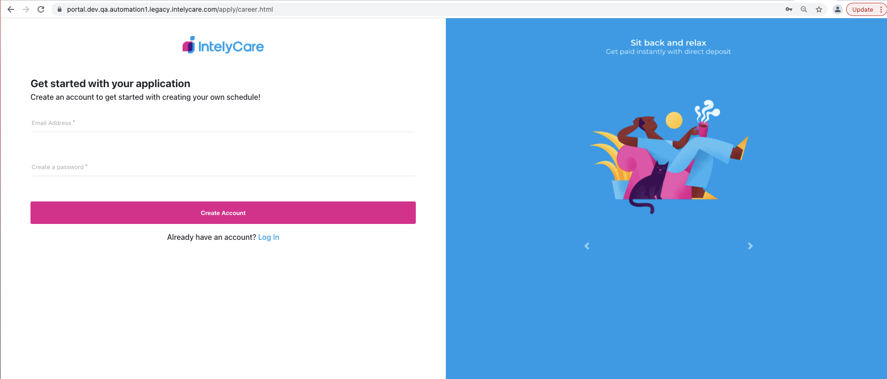
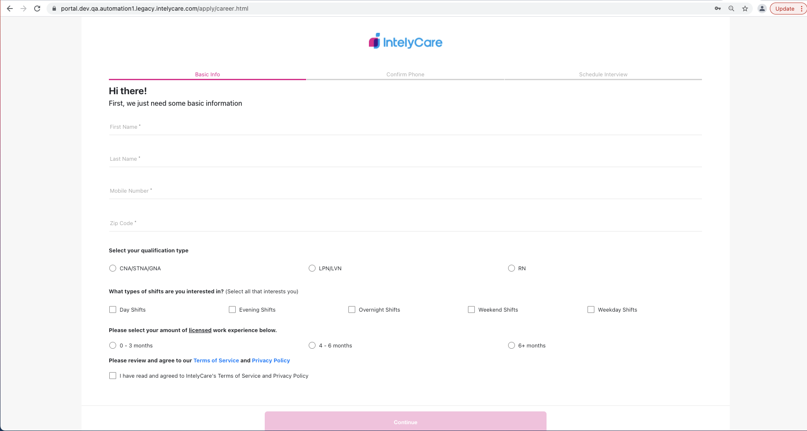

# SDET Automation Challenge

This will cover the instructions and details for the automation challenge

## Task
The task is to write an automated test validating that a user can create an account on the Intelycare application page and can proceed ahead with the next 2 steps in the application process.

1. Go to [Intelycare Careers](https://portal.dev.qa.automation1.legacy.intelycare.com/apply/career.html)
    a. Create the account using the email address. It be can any alphanumeric character with the domain name **@mailinator.com** and any password. 
    

2. On the Basic Info screen, validate below two test conditions
    a. The continue button is unclickable without mandatory fields
    b. Filling all the fields enable the Continue button
    c. Clicking on the continue button page redirects to OTP page 

**Note**: Please enter 10 digit phone number (7589577506) and 5 digit zip code (02090) for test data during testing.

## Test Framework Instructions
**Pre-Requisites**

1.	You need to have Java version 20.0.1 and Node v20.2.0 installed on your machine.
2.	Run “npm install” (without the quotes) before running the test scripts in order to install missing dependencies.
3.	Due to conflicts with Fountain on the AUT3 QA server, I’m using the Pod2 Platoon 4 QA env to execute my automation tests.
4.	Note: I’m committing Allure test reports/results to demonstrate that the code is working as expected.  Normally, this would be added to the .gitignore file. 

**Run the Following Commands to Execute Test Scripts**

1.	npm run wdio: Generates an allure-results folder containing several XML files
2.	npm run test: 
3.	npm run pretest: Deletes previously generated Allure test reports and results 
4.	npm run posttest: Generates Allure test reports and results 
5.	npm run runSmokeTest: Executes happypath.js test case
6.	npm run runRegressionTest: Executes negativepath.js test case
7.	npm run report: 
8.	npm run report-generate: Generates HTML test report based on XML files
9.	npm run report-open: Opens HTML test report using Allure

